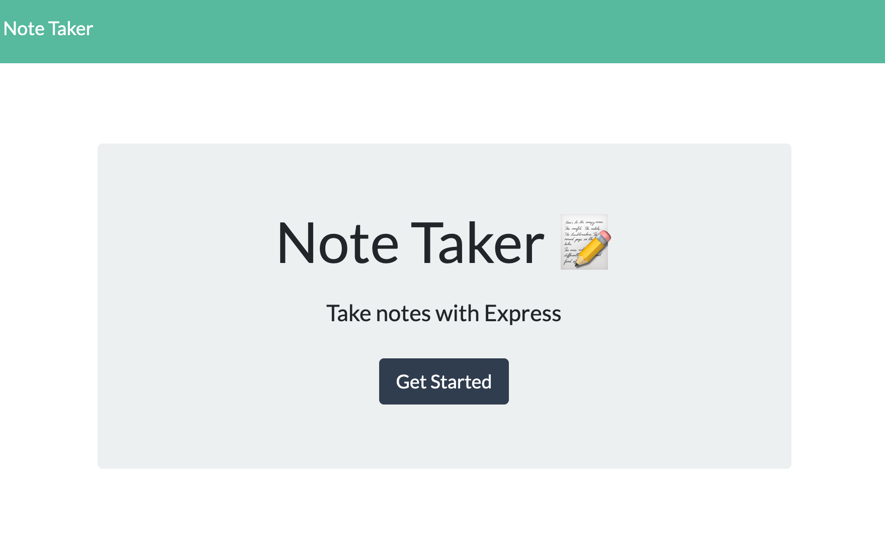
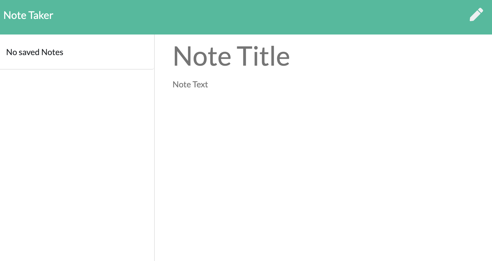
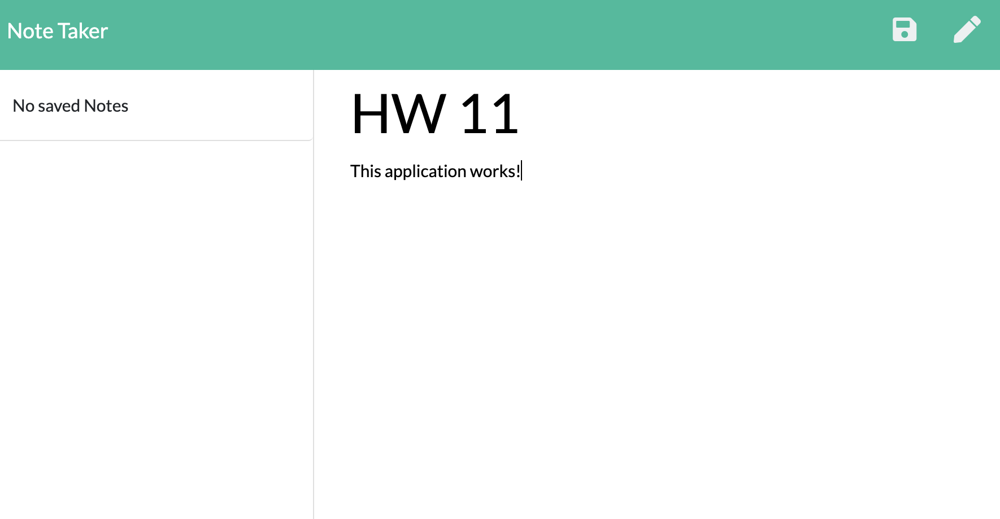
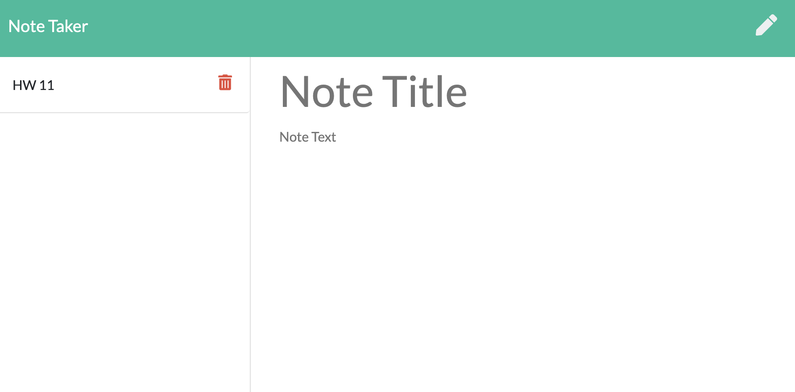

# Note Taker with Express

[See Deployed App Here](https://peaceful-plains-03083.herokuapp.com/)

  ## Table of Contents

  - [Description](#description)
  - [Installation](#installInstructions)
  - [Usage](#usageInfo)
  - [Contributions & Guidelines](#contributorGuidelines)
  - [Tests](#testInstructions)
  - [Questions](#questions)

  ## Description 

This Express Note Taker application will allow a user to take notes on an online application. Hosted through Horoku, the user will enter the application through the main url page and be prompted by, `Take Notes With Express`. The user can then click the `Get Started` button to launch the program. Once in the `Note Taker` section, the user can enter a title for their current note and a description. The user will have the ability to save the note, seeing all previous notes in a the left side of the application. The user also has the ability to delete any previous notes taken. View a preview of the deployed application below:

### Note Taker Home Page

### Note Taker Entry Page

### User Enters Not Title & Description

### User Can Save Note 

  ## Installation 

   To install this express application clone code to a local repository.

  ## Usage 

   To use this express application the user can use deployed application or clone repository to a local server.

  ## Contributions & Guidelines 

   This application was created by developer: Christina Flores. 

  ## Tests 

N/A 

  ## Questions 

  [To reach me by email click here.](mailto:.com) 

  [Click for my Github profile.](https://github.com/) 

  ## Badges 

  
   

